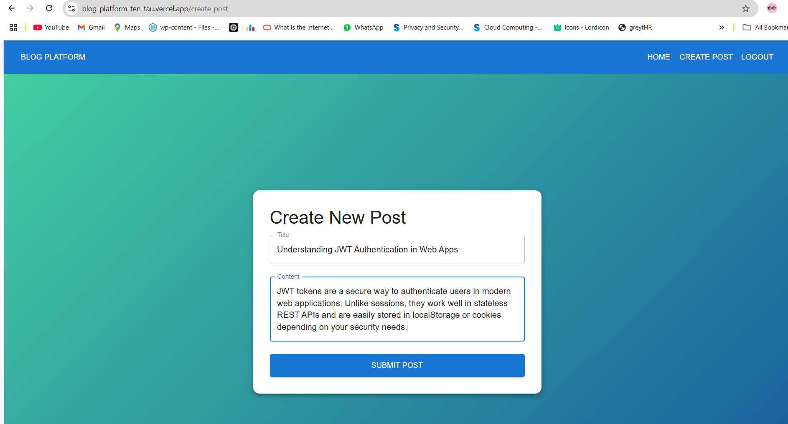

# Blog Platform – IgnIPC Assignment

This project is a **full-stack blog platform** built as part of the **IgnIPC Web Development Internship Assignment**. It includes user authentication, blog creation, editing, deletion, and a responsive UI — all built from scratch using modern technologies.

---

## 🚀 Tech Stack

- **Frontend**: Next.js (JavaScript)
- **Backend**: Fastify (Node.js)
- **Database**: PostgreSQL
- **UI**: Material-UI (MUI)
- **Auth**: JWT (stored in localStorage)
- **Deployment**: Vercel (frontend), Railway/Render (backend)

---

## Project Screenshots

### Homepage


### Login Page


### Posts List



### edit-delete List


## 👤 Demo Login

To test the app as an admin:

Username: admin
Password: 1234


Once logged in, you'll see buttons to:

- ✏️ **Edit** your own blog posts
- ❌ **Delete** your own blog posts
- ➕ **Create** a new blog post

Unauthenticated users can only view posts.

---

## 🧪 How to Run Locally

### 📦 Backend Setup

1. Install PostgreSQL and create a database:
```sql
CREATE DATABASE blog_platform;

CREATE TABLE users (
  id SERIAL PRIMARY KEY,
  username TEXT NOT NULL,
  password TEXT NOT NULL
);

CREATE TABLE posts (
  id SERIAL PRIMARY KEY,
  title TEXT NOT NULL,
  content TEXT NOT NULL,
  author TEXT NOT NULL
);


Start the backend:

bash
Copy
Edit
cd backend
npm install
npm start

Frontend Setup
bash
Copy
Edit
cd frontend
npm install
npm run dev
Visit: http://localhost:3000